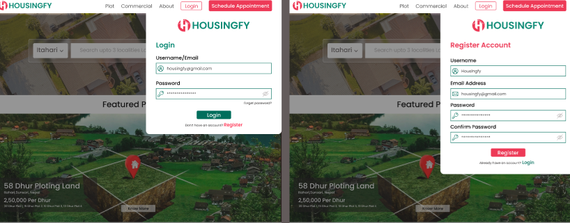

# 🏡 Housingfy - The Ultimate Real Estate Platform

Housingfy is a modern real estate platform built to simplify **property buying, selling, and tour scheduling**. Whether you're looking to invest in plots or commercial properties, Housingfy **provides a seamless and interactive experience tailored to your needs**.

With an **intuitive user interface, responsive design, and powerful backend, Housingfy connects buyers with sellers while offering** advanced features such as real-time appointment booking, property filtering, and automated notifications.

## 🌟 Why Choose Housingfy?

🔹 **Effortless Property Search** – Browse through a vast collection of properties with filters like location, price, and type.
🔹 **Hassle-Free Property Selling** – Sellers can list their properties with images, descriptions, and pricing.
🔹 **Interactive Property Tours** – Schedule property visits in a few clicks with an easy-to-use form.
🔹 **Mobile-Friendly & Responsive** – The platform is optimized for all devices, ensuring a smooth experience for users on mobile, tablet, and desktop.
🔹 **Real-Time Availability** – Book property tours based on available time slots with an integrated calendar & clock picker.
🔹 **Automated Notifications** – Get instant updates via email or SMS about property inquiries, tour confirmations, and promotions.
🔹 **Secure & Scalable** – Built using React.js, Node.js, and MongoDB, ensuring high performance, security, and scalability.

## 🏠 Types of Properties Available

📌 1. Plots (Land Properties)
**Plots available for residential and commercial use. Users can:**
✅ Browse available plots based on size, price, and location.
✅ View detailed descriptions and legal documents (if provided).
✅ Schedule an on-site visit directly through the platform.
✅ Connect with property sellers or agents for inquiries.

🏢 2. Commercial Properties
**Commercial spaces such as shops, offices, warehouses, and business hubs. Users can:**
✅ View commercial properties with details on area, rental price, and facilities.
✅ Request an in-person or virtual tour of the property.
✅ Negotiate pricing and connect with sellers.
✅ Receive market insights on commercial real estate trends.

## 🚀 Features

✅ **Buy & Sell Properties** – Users can explore available **plots** and **commercial properties** for sale.  
✅ **Schedule Property Tours** – Book a tour for any listed property using an interactive form.  
✅ **Mobile-Responsive UI** – A fully optimized experience across all devices.  
✅ **Pre-Filled User Information** – Auto-filled details for quick booking.  
✅ **Filter & Search Properties** – Find the perfect property using filters.  
✅ **Instant Notifications** – Get notified about bookings and property updates.

---

## 📸 Screenshots

>    Add images of your UI here

---

## 🏗️ Tech Stack

- **Frontend**: React.js, Tailwind CSS
- **Backend**: Node.js, Express.js / PHP
- **Database**: MongoDB
- **Authentication**: Firebase / JWT
- **Icons & UI Enhancements**: `react-icons`, `lucide-react`

---

## 🏡 Property Categories

### 🏞️ Plots

- Lands available for residential or commercial purposes.
- Buyers can **book site visits** and schedule **tours**.

### 🏢 Commercial Properties

- Office spaces, shops, and business hubs.
- Users can inquire about **property details** and **pricing**.

---

## ⚙️ Installation Guide

1️⃣ **Clone the repository**

```bash
git clone https://github.com/iamjameskhadka/housingfy.git
cd housingfy
```
